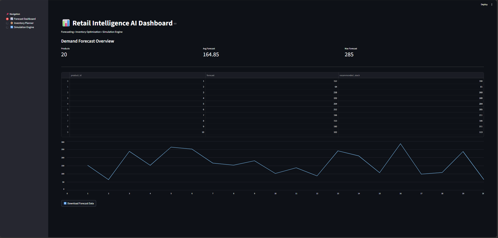
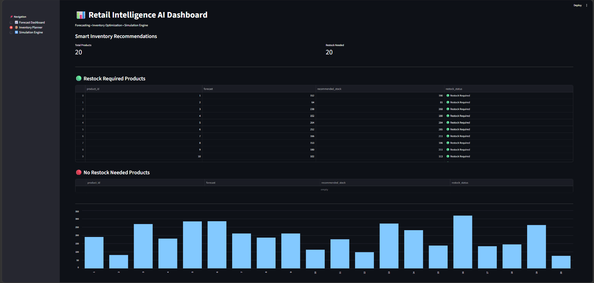
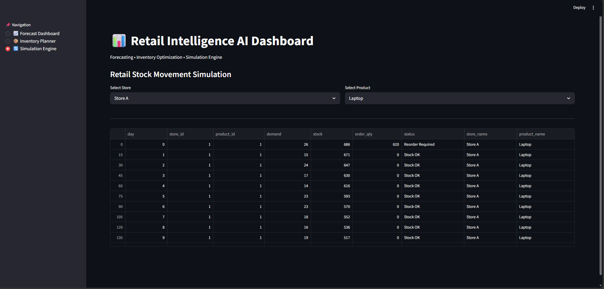

# 📊 Retail Intelligence AI System

An end-to-end AI-powered Retail Forecasting, Inventory Optimization, and Simulation system built using Python, Machine Learning, and Streamlit.

This project covers the full data science pipeline including data generation, preprocessing, feature engineering, model building, inventory optimization, anomaly detection, and retail simulation with an interactive dashboard.

---

## 🚀 Features

### 📈 Demand Forecasting
- Predicts product demand using ML models
- Stores forecast outputs as CSV and visual charts
- Supports multi-product and multi-store analysis

### 📦 Inventory Optimization
- Generates optimized stock recommendations
- Smart decision system:
  🟢 Restock Required  
  🔴 Not Required
- Helps in supply chain decision-making

### 🔄 Retail Simulation Engine
- Simulates real-world store-product sales behavior
- Tracks stock movement across multiple stores
- Helps analyze demand vs supply gaps

### 📊 Analytics Modules
- Model comparison system
- Feature engineering pipeline
- Data preprocessing pipeline
- Anomaly detection
- Promotional impact analysis

---

## 🧠 Business Logic

If Recommended Stock > Forecast → 🟢 Restock Required  
Else → 🔴 Not Required  

This replicates real-world inventory management decision systems used in retail supply chains.

---

## 🏗️ Project Structure

Retail-Forecasting-System/
│
├── assets/
│ ├── forecast.png
│ ├── inventory.png
│ ├── simulation.png
│
├── src/
├── app/
├── outputs/
├── models/
├── notebooks/
├── README.md
---

## ▶️ How to Run

1️⃣ Install dependencies  
pip install -r requirements.txt

2️⃣ Generate data / run pipeline  
python src/generate_data.py

3️⃣ Run Streamlit dashboard  
streamlit run app/streamlit_app.py

---

## 📊 Dashboard Highlights

- Forecast visualization with trend analysis  
- Inventory optimization with restock classification  
- Simulation engine for store-product analysis  
- Clean and interactive Streamlit UI  
- KPI-style business insights  

---

---

## 📸 Screenshots

### 📈 Forecast Results

### 📦 Inventory Optimization

### 🔄 Simulation Results

## 🧠 System Pipeline

Data Generation → Preprocessing → Feature Engineering → Model Training → Forecasting → Inventory Optimization → Simulation → Dashboard Visualization  

---

## 📌 Key Insights

- Supports multi-store retail simulation  
- Handles demand forecasting per product  
- Provides actionable inventory decisions  
- Visual analytics for business understanding  

---

## 🚀 Future Improvements

- Real-time database integration  
- Live model inference instead of CSV-based outputs  
- AI-based demand forecasting (LSTM / Deep Learning)  
- Automated reorder system  
- Advanced KPI dashboard (profit, revenue, loss tracking)  
- Alert system for stock risks  

---

## 👨‍💻 Overview

This project demonstrates a complete real-world retail intelligence system combining machine learning, simulation, and decision-making into a single unified analytics dashboard.

Author
Yusra Sheikh Ashfaq